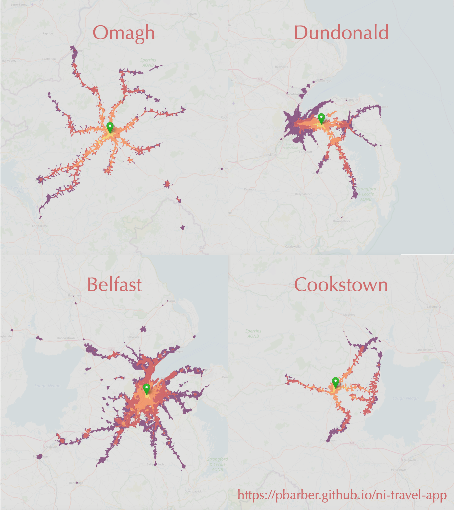

# UK isochrones map

A [searchable map of the UK](https://pbarber.github.io/uk-isochrones-map) showing areas that can be reached from different locations using public transport within 15/30/45/60 minutes.

The map shows two markers:

* blue: the location that you searched for
* green: the starting location for the travel areas displayed, click the marker to change the opacity of the underlying map

To hide/show different travel times, click the coloured box in the map legend. 

The map for each starting location can be shared using the share button, for example the map for [Omagh](https://pbarber.github.io/uk-isochrones-map?sa=N00004361).

For NI, where the map was initially developed, the travel areas are limited to 4537 starting locations (green markers). In rural areas the starting locations are sparsely located. The travel areas do not always appear to make logical sense, e.g.:

* searching for Belfast International Airport will provide a starting location at the 'wrong' side of the runway
* searching for Rowallane will use a starting location south of Saintfield, rather than in the centre of Saintfield

You may get better results by searching for locations on the opposite side of your initial search from the green marker.

If you like the map and can afford it, please [donate to Action Cancer]() or [buy me a coffee]().

## Privacy

The app uses Google Analytics to measure usage and to capture search and starting locations.

## Datasets

The app makes use of a single open dataset which is split by geography:

* [UK Travel Area Isochrones (Nov/Dec 2022) by Public Transport and Walking for Northern Ireland - Generalised to 10m](https://geoportal.statistics.gov.uk/datasets/7f1c281b2561483891cd797b0f6fd463/explore): the boundaries of the areas that can be reached using public transport from each Small Area in NI

It also uses [OpenStreetMap](https://www.openstreetmap.org/)/[Nominatim](https://wiki.openstreetmap.org/wiki/Nominatim) to provide the search results.

## Examples

* [Cookstown](https://pbarber.github.io/uk-isochrones-app/?sa=N00002130)
* [Omagh](https://pbarber.github.io/uk-isochrones-app/?sa=N00004361)
* [Dundonald](https://pbarber.github.io/uk-isochrones-app/?sa=N00001821)
* [Belfast Great Victoria Street](https://pbarber.github.io/uk-isochrones-app/?sa=N00001417)



## Technical details

Don't read any further unless you really want to.

### Isochrones

The data used in the app comes from [here](https://geoportal.statistics.gov.uk/datasets/7f1c281b2561483891cd797b0f6fd463/explore), and contains four entries for each Small Area (`SA2011`) in NI (4537 Small Areas), on date 2022-12-06. The four entries have `iso_cutoff` of 900, 1800, 2700 and 3600.

The original data source is [ArcGIS](https://services1.arcgis.com/ESMARspQHYMw9BZ9/arcgis/rest/services/Northern_Ireland_Isochrones_Gen/FeatureServer). The best documentation I have found is [here](https://geoportal.statistics.gov.uk/datasets/ons::uk-travel-area-isochrones-nov-dec-2022-by-public-transport-and-walking-for-north-west-north-generalised-to-10m/about).

The meaning of `iso_cutoff` is:

> The maximum travel time, in seconds, to construct the reachable area/isochrone. Values are either 900, 1800, 2700, or 3600 which correspond to 15, 30, 45, and 60 minute limits respectively.

The centre point used is key to plotting on a map, this is defined by `iso_type`. Most values are `from_centroid` but other are used, so this needs to be dynamic. Though, given that the data is at Small Area level, probably just simplest to map Small Area initially.

Whilst the shapes of the areas are in WGS84, the centroid/stop/node coordinates for NI are in Irish Grid and for the rest of the UK are in OS grid.

I split the isochrones dataset into one file per Small Area, in order to save the app from having to download the whole dataset. This conversion process is handled in [notebook.py](notebook.py). The files are hosted on AWS S3.

### App setup

To run the app, clone the github repo and open [index.html](index.html) in a web browser. The app consists of a single HTML file and uses JavaScript.

Key JavaScript libraries used are:

* [Leaflet](https://leafletjs.com/) - for the base map, markers, zoom and isochrones
* [Leaflet Control Geocoder](https://github.com/perliedman/leaflet-control-geocoder) - for the search box and results
* [Leaflet.PointInPolygon](https://github.com/hayeswise/Leaflet.PointInPolygon) - to find the searched point's isochrone

### Python setup

To create the map file, use the following.

Developed in Visual Studio Code using the [Remote-Containers](https://code.visualstudio.com/docs/devcontainers/containers) extension. To start the container, open `docker-compose.yml` and select `Docker: Compose Up`. Then find the `ni-travel-app_dev` container and right-click it, choose `Attach Visual Studio Code`. This will open a new window within the container. The first time you run the container you will need to install the Python extension, and choose the Python interpreter at `/usr/local/bin/python`.

To run the processing script run the following in the VS Code terminal:

```bash
python process.py --help
```

Key Python libraries used are:

* [Geopandas](https://geopandas.org/en/stable/) - for manipulating the isochrone dataset
* [Pandas](https://pandas.pydata.org/) - for general data manipulation
* [Requests](https://requests.readthedocs.io/en/latest/) - for getting data from URLs
